# Modélisation Géométrique

## **TP1**

Modélisation géométrique de mesh dynamiquement sur unity.

### Générer un mesh

Pour générer un mesh custom, il faut accéder à la fenêtre **Generate Custom Mesh**, accessible par *Generate -> Mesh*.

    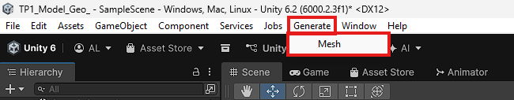

    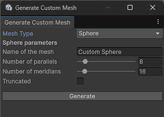

Cette fenêtre pêrmet de créer les différents types de mesh du TP1, ainsi que la possibilité de les tronquer.

    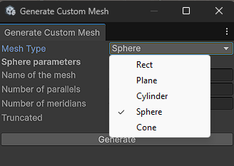

Une fois le bouton **Generate** appuyé, le mesh sera créé sous *Assets/Meshs*.

*Il y a actuellement tous les meshs créés pour les exemples qui suivent.* 

    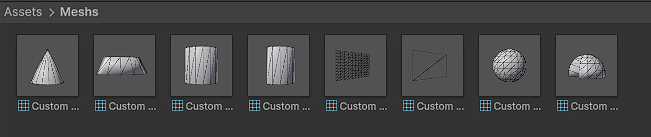

### Tester un mesh

Pour tester un mesh nouvellement créé, il suffit d'accéder à une scène, puis de créer un **Empty** gameObject.

*Dans ma scène il existe déjà un objet **TestObject**.*

    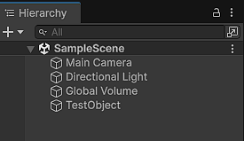

Il faut ajouter à ce gameObject un **Mesh Filter** ainsi qu'un **Mesh Renderer**.

*Je conseille de mettre le matériau **SpatialMappingWireframe** dans le Mesh Renderer afin de bien voir les triangles du mesh.*

    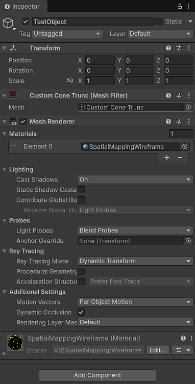

Ensuite, il ne reste plus qu'à sélectionner le mesh voulu dans le **Mesh Filter**.

    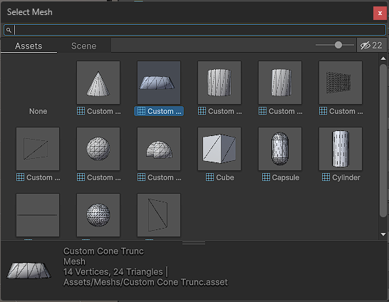

### Résultats

#### Rectangle

    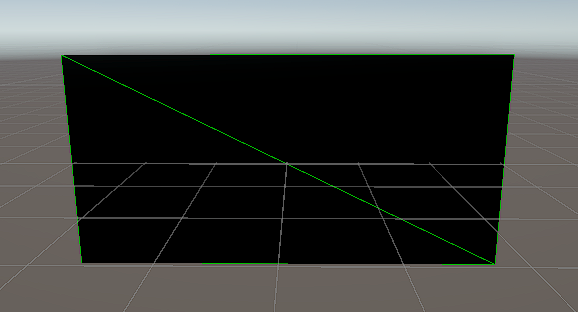

#### Plan

    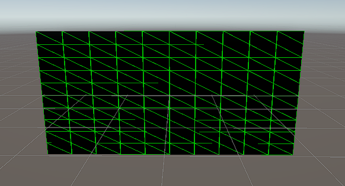

#### Cylindre

    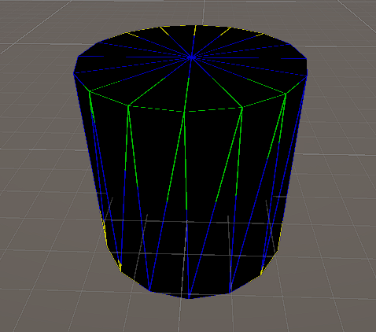

#### Sphère

    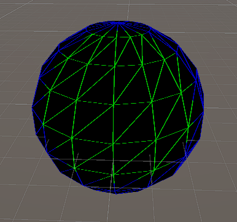

#### Cône

    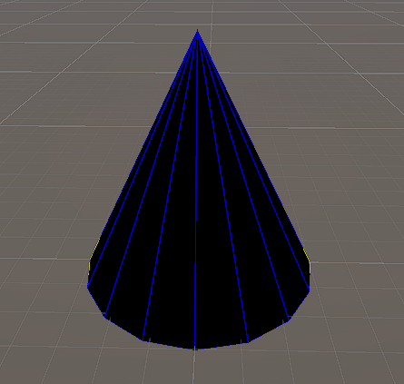

#### Tronquage

    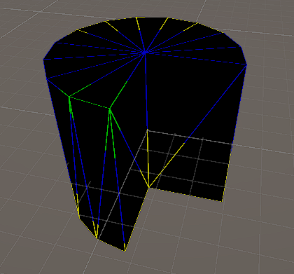
    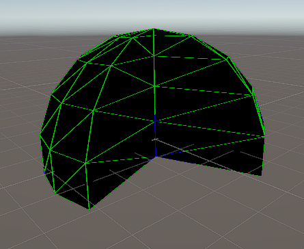
    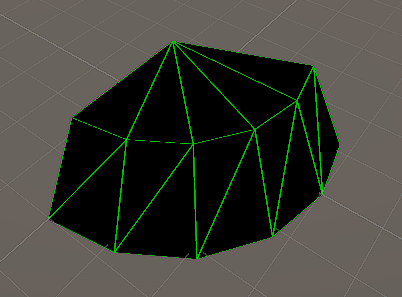

### Scripts

Les scripts pour générer les meshs sont dans *Assets/Scripts/MeshUtils.cs*.

## **TP2**

Ouverture et sauvegarde de fichiers OFF

### OFF File windows

The path to access OFF tools.

    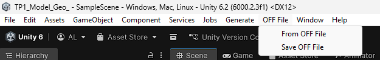

#### Create mesh from OFF file

The window to create a mesh from an OFF file.

    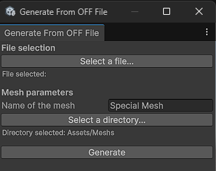

#### Save mesh into OFF file

The window to save a mesh into an OFF file.

    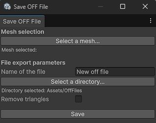

### Results

#### Mesh import

The results of the import from OFF files.

    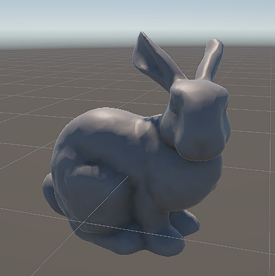
    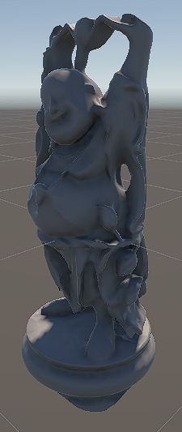

#### Mesh export

*Here I export the buddha mesh without 10 000 of his triangle, and after, that I import this new mesh. This manip shows that the export function is working.*

The result of the success of export the buddha without all his mesh triangles.

    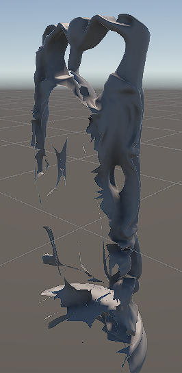

## **TP3**

### Spatial Enumeration

The object is to create a volumetric representation of a sphere.

### 